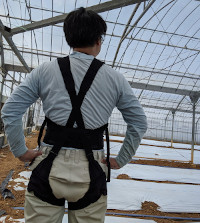
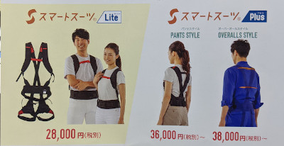
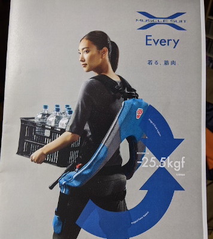
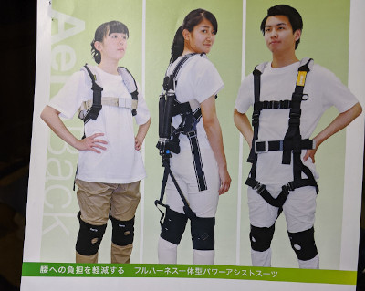
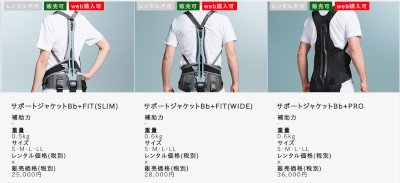
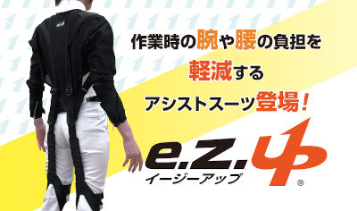
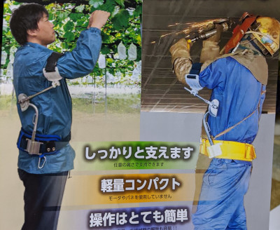
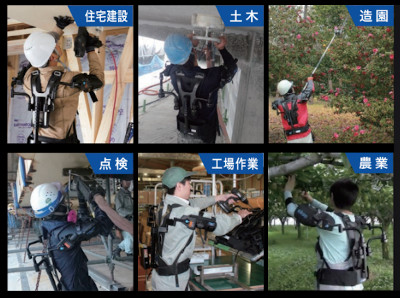
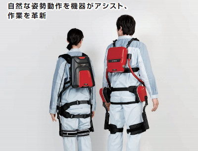

# Assist Suite Reviews
　市販されている農業用アシスト／パワードスーツに対するレビューです．私が試着したことのある＆気になってるスーツを中心に記載しています．
## Introduction
　私は農業に従事しています．農業と言えば“肉体的にキツい”というイメージが強いのではないかと思います．しかし，近年は機械化や施設園芸の普及などにより，農業全体で見れば一昔と比べキツい作業は少なくなってきました．とはいえ，畜産，水稲，果樹，野菜など，個別で見れば機械化が難しく肉体的にキツい作業はまだまだ残っています．

　そこで期待されるのが，アシストスーツやパワードスーツといった肉体的負荷を軽減する技術です．ここでは，既に市販され購入可能なスーツを中心に，実際に試してみたレビューを記載していこうと思います．

## Reviews
## 1.スマートスーツLite/Plus

|開発元|株式会社スマートサポート（北大発認定ベンチャー企業）|
| --- | --- |
|URL|[https://smartsuit.org](https://smartsuit.org)|

### 仕様
|アシスト部位|腰|
|:--- |:--- |
|アシスト方法|ゴム|
|アシスト力|腰の負担25%軽減(個人差あり)|
|重量|約450g|
|サイズ|S,M,L,XL|
|メーカ保証|なし（試験販売の経緯から3年間は問題なく使用できるとのこと）|
|価格|約3〜4万円|

### 所感
　LiteとPlusの2種類あり，下半身の固定方法が異なる．Liteは太ももをマジックテープのベルトで固定するが，Plusはツナギと一体になっており足の土踏まずにベルトを引っ掛けることで固定する．

　ゴムの張力により腰への負担が軽減される．アシスト力は比較的弱いが，その反面，軽量で身体に密着しかさばらないため，様々な作業を行なうことができる．また，装着した上から作業着を羽織ることができる点も良い．朝仕事へ行く時に装着して，そのまま1日の畑仕事を行える．加えて，価格がお手頃なのも良い．現状ではコスパが最も良いと思われる．

　Liteは長時間使用していると，太ももの固定部が擦れて少し痛い．また，立ったりしゃがんだりを繰り返す作業（定植など）を長時間やっていると，太もものベルトが横にズレてしまう（それらを改善したのがPlusなんだろう多分）.

## 2.MUSCLE SUIT Every

|販売元|株式会社イノフェス(東京理科大学発ベンチャー)|
| --- | --- |
|URL|[https://musclesuit.co.jp/product/](https://musclesuit.co.jp/product)|

#### 仕様
|アシスト部位|腰|
|:--- |:--- |
|アシスト方法|人工筋肉|
|アシスト力|Max 25.5kgf|
|重量|3.8Kg|
|サイズ|S-M, S-L|
|メーカ保証|6ヶ月（1年に延長可）|
|価格|約14万円前後|

### 所感
　合成樹脂製のフレームが入っているため，腰と太ももがしっかり固定される．空気入れが付属しており，人工筋肉に注入する空気圧でアシスト量を調整することが可能．荷物を持ち上げる時の姿勢に慣れ（腰を使って持ち上げるようにする）が必要だが，慣れると十分アシストを感じる．

　背負うフレームがそれなりに大きいため，作業場所によっては邪魔になる．また，太もものフレームを着けたままだと，とても歩き難い（フレームの着脱は可能）．トラックへの荷積み作業では有効そうであるが，それ以外ではあまりメリットが少なそう．様々な作業を少ない人数で回している小規模農家では，若干コスパが悪そうか．

## 3.AeroBack

|開発元|株式会社サステクノ|
| --- | --- |
|URL|[https://sustechno.co.jp/?page_id=56](https://sustechno.co.jp/?page_id=56)

### 仕様
|アシスト部位|腰|
|:--- |:--- |
|アシスト方法|人工筋肉|
|アシスト力|18kgf|
|重量|1.8Kg|
|サイズ|フリーサイズ|
|メーカ保証|1年間|
|価格|[30万円](https://newswitch.jp/p/14480)|

### 所感
　ハーネスで身体に固定するタイプ．背中に着いた人工筋肉と太ももともハーネスで繋ぐことで，腰の補助を行なう．慣れないと装着に時間がかかりそうだが，一度着けてしまえば歩きにくいなどの不便は無かった．MUSLE SUIT同様に持ち上げる時の姿勢に慣れが必要．高価格．

## 4.サポートジャケットBb+FIT

(画像の参照は[https://upr-net.co.jp/products_type/suit](https://upr-net.co.jp/products_type/suit)より）

|開発元|ユーピーアール株式会社|
| --- | --- |
|URL|[https://upr-net.co.jp/products_type/suit](https://upr-net.co.jp/products_type/suit)|

### 仕様
|アシスト部位|背中〜腰|
|:--- |:--- |
|アシスト方法|棒+ゴム|
|アシスト力|-|
|重量|?|
|サイズ|S,M,L,LL|
|メーカ保証|?|
|価格|2.5万〜3.6万円|

### 所感
（未試着）写真を見るに姿勢が良くなりそう．デスクワークで使いたいかも．

## 5.e.z.Up

(画像の参照は[https://asahicho.co.jp/ezup_lp](https://asahicho.co.jp/ezup_lp)より）

|開発元|旭蝶繊維株式会社|
| --- | --- |
|URL|[https://asahicho.co.jp/ezup_lp/ezup_lp](https://asahicho.co.jp/ezup_lp)|

### 仕様
|アシスト部位|腰|
|:--- |:--- |
|アシスト方法|ゴム|
|アシスト力|?|
|重量|?|
|サイズ|S,L,XL|
|メーカ保証|?|
|価格|3.9万円|

### 所感
（未試着）写真を見るに足裏で固定するタイプなので，太ももへの負担や固定具のズレは少なそう．

## 6.腕楽っく

|開発元|株式会社ニッカリ|
| --- | --- |
|URL|[https://nikkari.co.jp/product/assist/arm_assist](https://nikkari.co.jp/product/assist/arm_assist)|

### 仕様
|アシスト部位|腕|
|:--- |:--- |
|アシスト方法|固定|
|アシスト力|-|
|重量|1.8Kg|
|サイズ|フリーサイズ|
|メーカ保証|?|
|価格|[約4.3万円](https://store.shopping.yahoo.co.jp/aztec/nkr-asn110.html)|

### 所感
（未試着）つる下ろし作業に使えそう．

## 7.TASK AR1.0

(画像の参照は[https://daydo.jp/product_task_ar1.html](https://daydo.jp/product_task_ar1.html)より)

|開発元|株式会社ダイドー|
| --- | --- |
|URL|[https://daydo.jp/product_task_ar1.html](https://daydo.jp/product_task_ar1.html)|

### 仕様
|アシスト部位|腕|
|:--- |:--- |
|アシスト方法|ガススプリング|
|アシスト力|2.2〜6.8Kg|
|重量|3.9Kg|
|サイズ|1種類|
|メーカ保証|1年間|
|価格|[30万円](https://response.jp/article/2019/01/18/318209.html)|

### 所感
（未試着）上向き作業のアシストを行なう．

## 8.J-PAS

(画像の参照は[https://j-pas.jtekt.co.jp](https://j-pas.jtekt.co.jp)より)

|開発元|株式会社ジェイテクト|
| --- | --- |
|URL|[https://j-pas.jtekt.co.jp](https://j-pas.jtekt.co.jp)|

### 仕様
|アシスト部位|腰|
|:--- |:--- |
|アシスト方法|電動モータ|
|アシスト力|40Nm:16Kg相当|
|重量|7.6Kg|
|サイズ|身長155〜180cm推奨|
|メーカ保証|?|
|価格|[130万円](https://newswitch.jp/14480)|

### 所感
（未試着）動力付きパワードスーツも市販されるようにはなってきているが，やはりまだ高額．

